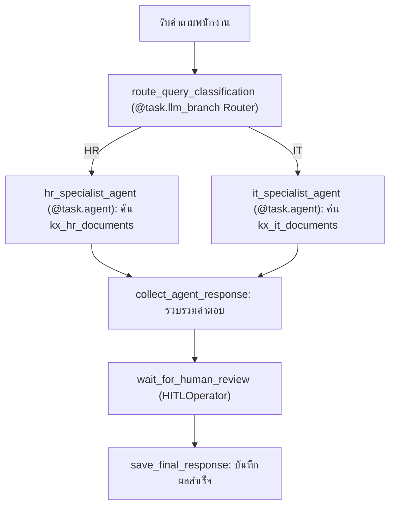

# Lab 04: Multi-Agent Workflows & Human-in-the-Loop (HITL)

ยินดีต้อนรับเข้าสู่บทปฏิบัติการขั้นสูงที่สุดของหลักสูตร ในแล็บนี้เราจะมาเจาะลึกกระบวนการเชื่อมโยงระบบแบบ **Multi-Agent (หลายเอเจนต์เฉพาะทาง)** ทำการแยกถังประมวลผลข้อมูลเวกเตอร์ (Vector Storage Buckets) และควบคุมการทำงานอย่างปลอดภัยผ่านขั้นตอนการทวนสอบโดยมนุษย์ (HITL)

---

## 1. เปรียบเทียบความแตกต่างเชิงสถาปัตยกรรม (Comparison)

ในระบบ Enterprise จริง ข้อมูลมีความหลากหลายแผนก การยัดเอกสารทุกเรื่องลงถังเดียวกันจะทำให้การค้นหาไร้ประสิทธิภาพและสับสน เราจึงประยุกต์ใช้งาน Multi-Agent:

| หัวข้อเปรียบเทียบ | RAG แบบปกติ (`@task.llm` - Lab 3) | Multi-Agent RAG (`@task.agent` - Lab 4) |
| :--- | :--- | :--- |
| **ขอบเขตข้อมูล** | **เดี่ยว (Single Bucket)**: ค้นหาจากคลังข้อมูลรวม | **หลายถังแยกอิสระ (Separated Buckets)**: แยกถังข้อมูลของฝ่าย HR และ IT |
| **กระบวนการเลือกทาง** | **คงที่ (Static)**: ทำงานเส้นตรงตามที่ระบุใน DAG | **อัตโนมัติ (Dynamic Routing)**: มีระบบวิเคราะห์คำถามพนักงาน (LLM Router) เพื่อจำแนกและส่งต่อให้เอเจนต์เฉพาะทางตัวที่ถูกต้องทำงาน |
| **เอเจนต์ผู้ประมวลผล** | ไม่มีตัวตนเฉพาะเจาะจง (ส่ง Prompt ยาวตรงหาโมเดล) | มีเอเจนต์ย่อย: **HR Specialist Agent** (ใช้เครื่องมือค้นหา HR DB เท่านั้น) และ **IT Specialist Agent** (ใช้เครื่องมือค้นหา IT DB เท่านั้น) |
| **ความมั่นใจด้านความถูกต้อง** | รันเสร็จจัดส่งทันที (หาก AI สรุปผิดพลาด ผู้รับจะได้รับข้อมูลที่ผิด) | มีระบบกักรอตรวจทานคำตอบโดยมนุษย์ (**`HITLOperator`**) ก่อนบันทึกเข้าเซิร์ฟเวอร์หลัก |

---

## 2. ขั้นตอนการทำงานภายในท่อส่งข้อมูล (`lab04_multi_agent_hitl`)



*   **`route_query_classification`**: ตกแต่งด้วย `@task.llm_branch` ทำหน้าที่จำแนกคำถามและแตกกิ่งพาร์ทเส้นทางไปยัง Task ID ปลายทางในขั้นตอนเดียว
*   **Specialist Agents**: ตกแต่งด้วย `@task.agent` ทำงานคิดแบบ ReAct Loop เข้าถึงถังข้อมูลเฉพาะฝ่ายตนเองผ่านเครื่องมือช่วยสืบค้น

---

## 3. ขั้นตอนการทดสอบรันแล็บ

*ตรวจสอบให้แน่ใจว่าคุณได้กรอก `GEMINI_API_KEY` ในไฟล์ `.env` ของ Lab 3 เรียบร้อยแล้ว และได้สร้าง Connection `gemini_conn` (Type: `Pydantic AI`, Model: `google:gemini-3.1-flash-lite`) ตามขั้นตอนใน README ของ Lab 3 แล้ว เพราะ `@task.llm_branch` และ `@task.agent` ใช้ connection เดียวกันนี้*

### ขั้นตอนที่ 1: คัดลอกไฟล์ DAG ไปยังห้องเครื่องหลัก
รันคำสั่งย้ายสคริปต์ตัวอย่างไปยังโฟลเดอร์ปฏิบัติการหลักตามระบบปฏิบัติการของคุณ:
*   **macOS / Linux (Terminal)**:
    ```bash
    cp labs/04-ai-agent-bonus/dags/dag_task_agent_hitl.py labs/03-rag-airflow/dags/
    ```
*   **Windows (Command Prompt / CMD)**:
    ```cmd
    copy labs\04-ai-agent-bonus\dags\dag_task_agent_hitl.py labs\03-rag-airflow\dags\
    ```
*   **Windows (PowerShell)**:
    ```powershell
    Copy-Item labs\04-ai-agent-bonus\dags\dag_task_agent_hitl.py labs\03-rag-airflow\dags\
    ```

---

### ขั้นตอนที่ 2: เตรียมเวกเตอร์แยกถังก่อน (จาก Lab 3)
1. ป้อนไฟล์ `hr_policy.pdf` (ก๊อปปี้จาก `policy_leave.pdf` หรือไฟล์ HR อื่นๆ) นำมาหย่อนในโฟลเดอร์รันของ Airflow แล้วรัน DAG `lab03_hr_ingestion` เพื่อนำเข้าเวกเตอร์ถัง HR
2. ป้อนไฟล์ `it_policy.pdf` (ก๊อปปี้จาก `policy_itsupport.pdf`) นำมาหย่อน แล้วรัน DAG `lab03_it_ingestion` เพื่อนำเข้าเวกเตอร์ถัง IT

---

### ขั้นตอนที่ 3: สั่งรันบอร์ดทดสอบจำลอง (Multi-Agent Running)
1. เปิดสวิตช์รัน DAG `lab04_multi_agent_hitl` ใน Airflow UI
2. สั่งรันแบบกำหนดค่า **Trigger DAG w/ config** โดยจำลองป้อนคำถามเป็น JSON:

#### กรณีทดสอบ 1: ถามคำถามฝ่าย IT Support
```json
{
  "query": "รหัสผ่านไอทีต้องตั้งอย่างน้อยกี่ตัวอักษร และเคลมคอมพิวเตอร์ใหม่ได้เมื่อไร?"
}
```
*   **ผลการทำงาน**: ตัววิเคราะห์ (Router `@task.llm_branch`) จะประเมินและจำแนกว่าเป็น "IT" และแตกกิ่งไปรันเฉพาะ Task `it_specialist_agent` ทันที (HR agent จะขึ้นสถานะ skipped สีชมพู)

#### กรณีทดสอบ 2: ถามคำถามฝ่าย HR สวัสดิการ
```json
{
  "query": "สวัสดิการเบิกค่ารักษาพยาบาลวงเงินกี่บาทต่อปี?"
}
```
*   **ผลการทำงาน**: ตัววิเคราะห์จะประเมินและจำแนกว่าเป็น "HR" และแตกกิ่งไปรันเฉพาะ Task `hr_specialist_agent`

---

### ขั้นตอนที่ 4: ตรวจทานคำตอบ (HITL Stage)
1. เมื่อ Task ใดทำสำเร็จ โฟลว์จะหยุดรออนุมัติที่ Task `wait_for_human_review` (สถานะ `awaiting_input`)
2. กดคลิกที่ Task `wait_for_human_review` -> เลือกแถบ **HITL / Approval Request**
3. ตรวจทานว่าเอเจนต์ที่เกี่ยวข้องนำคำตอบจากถังเวกเตอร์ที่ถูกต้องมาตอบใช่หรือไม่ จากนั้นกด **Approve** เพื่อสั่งตอบกลับสมบูรณ์แบบ
