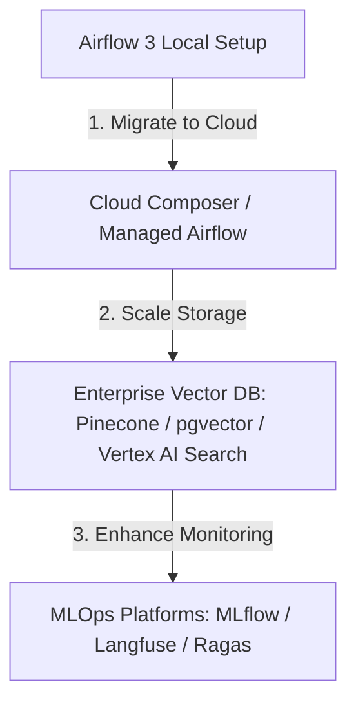

# Session 05 Lab Guide: RAG Pipeline under MLOps & DataOps Frameworks

ยินดีต้อนรับเข้าสู่บทสรุปของหลักสูตร ในเซสชันนี้เราจะมาเจาะลึกภาพรวมการบริหารจัดการระบบท่อส่งข้อมูล RAG เมื่อนำขึ้นใช้งานในระบบจริง (Production Environment) ภายใต้สองกรอบแนวคิดหลักคือ **DataOps** และ **MLOps**

---

## 1. กรอบแนวคิด DataOps สำหรับ RAG Ingestion

**DataOps (Data Operations)** เน้นการปรับปรุงคุณภาพ ความรวดเร็ว และความถูกต้องในการจัดส่งข้อมูลจากต้นทางไปยังปลายทางแบบอัตโนมัติ

### แนวทางการประยุกต์ใช้ในท่อส่ง RAG:

1.  **การตรวจสอบคุณภาพข้อมูลต้นน้ำ (Data Quality Checks)**:
    *   ต้องตรวจสอบประเภทไฟล์และรูปแบบก่อนประมวลผลเสมอ (เช่น ตรวจหาไฟล์เปล่า ขนาดไฟล์ที่ใหญ่ผิดปกติ หรืออักขระแปลกปลอมที่เกิดจากสแกนเอกสารล้มเหลว)
    *   การนำ **Great Expectations** หรือไลบรารีตรวจเช็คข้อมูลมาเชื่อมใน Task แรกๆ ก่อนทำการแบ่งคำ (Chunking)
2.  **การเฝ้าสังเกตและระบบแจ้งเตือน (Pipeline Monitoring & Alerting)**:
    *   ตั้งค่าระบบแจ้งเตือนความผิดพลาด (Failure Alerts) ของ Airflow ผ่าน Webhook ไปยัง Slack, Discord หรือ Microsoft Teams เมื่อ Task หรือ Sensor ล้มเหลว
    *   การติดตาม SLA (Service Level Agreement) เพื่อดูระยะเวลาที่ท่อส่งทำงาน เพื่อตรวจสอบปัญหาคอขวด (Bottlenecks)
3.  **ความมั่นใจในการรันซ้ำ (Idempotency)**:
    *   ท่อส่งข้อมูลต้องทำงานแยกอิสระตามแต่ละวัน/เหตุการณ์ได้โดยไม่เขียนข้อมูลเวกเตอร์ทับซ้อนหรือทำข้อมูลหลุดหาย

---

## 2. กรอบแนวคิด MLOps สำหรับ Vector Data & LLMs

**MLOps (Machine Learning Operations)** เน้นการบริหารจัดการวงจรของโมเดลปัญญาประดิษฐ์ (AI Models Life Cycle) ตั้งแต่การพัฒนาระบบ การทดสอบ ไปจนถึงการควบคุมดูแลติดตามผลการทำงาน

### แนวทางการประยุกต์ใช้ในท่อส่ง RAG:

1.  **การตรวจสอบโมเดลแปลงเวกเตอร์ (Embedding Model Versioning)**:
    *   > [!CAUTION]
        > **ข้อควรระวังขั้นสูง**: หากมีการอัปเดตเวอร์ชันโมเดลสำหรับแปลงคำศัพท์เป็นเวกเตอร์ (เช่น เปลี่ยนจาก `text-embedding-004` ไปใช้โมเดลใหม่ในอนาคต) เวกเตอร์เดิมที่บันทึกอยู่ใน ChromaDB จะ**ไม่สามารถนำมาคำนวณเปรียบเทียบระยะความใกล้เคียงกันได้อีกต่อไป**
    *   **แนวทางการแก้ปัญหา**: ต้องเก็บประวัติเวอร์ชันของโมเดลไว้ใน Metadata และเตรียมขั้นตอนการแปลงเวกเตอร์ใหม่ของคลังเอกสารทั้งหมด (Re-indexing) เสมอเมื่อสลับโมเดลตัวแปลง
2.  **การวัดประสิทธิภาพการค้นหาข้อมูล (Retrieval Evaluation)**:
    *   ต้องประเมินว่าระบบ RAG ดึงข้อมูลได้แม่นยำหรือไม่โดยใช้มาตรวัด เช่น **Hit Rate** (ดึงบริบทที่ถูกต้องได้กี่เปอร์เซ็นต์) หรือการคำนวณ **Cosine Similarity** ของประโยคสืบค้น
    *   ใช้เฟรมเวิร์กในการช่วยประเมินการทำงานเช่น **Ragas** เพื่อวัดระดับความแม่นยำของผลลัพธ์บริบท (Context Precision) และระดับการหลอนหรือเดาคำตอบของโมเดล (Faithfulness)
3.  **การจัดการความพร้อมใช้งานโมเดล (Model & API Monitoring)**:
    *   ติดตามจำนวนโทเค็นการใช้งาน (Token Usage) เพื่อควบคุมค่าใช้จ่าย
    *   ติดตามสถิติการถูกปฏิเสธเนื่องจากติดกฎการควบคุม (Safety ratings/Guardrails block) ของ Gemini API ในกรณีพนักงานถามคำถามต้องห้าม

---

## 3. สรุปแนวทางการพัฒนาต่อยอดในอนาคต (Future Scaling)

หลังจากผ่านพ้นหลักสูตรนี้ไป ผู้เรียนสามารถต่อยอดองค์ความรู้เพื่อใช้งานในบริษัทระดับจริงได้ดังนี้:



1.  **การเปลี่ยนโครงสร้างเก็บข้อมูลระดับองค์กร (Enterprise Vector DB)**: จาก ChromaDB แบบ Persistent/Ephemeral ในโปรเจกต์ศึกษา ให้เปลี่ยนเป็นฐานข้อมูลเวกเตอร์แบบกระจายศูนย์กลาง เช่น **pgvector (PostgreSQL)**, **Pinecone**, **Qdrant** หรือบริการจัดการสืบค้นความรู้สำเร็จรูปอย่าง **Vertex AI Search** บน Google Cloud Platform (GCP)
2.  **ขยายระบบ Orchestration สู่คลาวด์ (Cloud-native Orchestration)**: พัฒนาระบบโดยใช้ **Google Cloud Composer** (Managed Airflow) เพื่อประหยัดเวลาการดูแลรักษาระบบฐานข้อมูลและโครงสร้างพื้นฐานของ Airflow
3.  **ความปลอดภัยข้อมูลส่วนบุคคล (Data Privacy & Security)**: หากประมวลผลเอกสารสำคัญของบริษัท ให้ตรวจสอบข้อกำหนดพระราชบัญญัติคุ้มครองข้อมูลส่วนบุคคล (PDPA) ก่อนการส่งข้อมูลออกไปเรียกภายนอก หรือนำระบบคัดกรองข้อมูลส่วนบุคคล (PII Redaction) มาเสริมใน Task ต้นท่อส่งข้อมูล

---

## 4. การล้างข้อมูลและทรัพยากร (Clean up & Shutdown)

เมื่อจบการสัมมนาและต้องการปิดบริการระบบคอนเทนเนอร์ทั้งหมดเพื่อคืนกำลังของหน่วยความจำเครื่อง ให้รันคำสั่งเหล่านี้:

1. นำระบบ Docker-Compose ลงพร้อมทั้งลบข้อมูลเดิมที่ประมวลผลออกทั้งหมด ( Volumes ):
   *   **macOS / Linux / Windows (คำสั่งเดียวกัน)**:
       ```bash
       docker-compose down -v
       ```
2. ลบไฟล์ตัวแปรสภาพแวดล้อม `.env` หากต้องการล้างคีย์ส่วนตัวออก:
   *   **macOS / Linux**:
       ```bash
       rm .env
       ```
   *   **Windows (CMD)**:
       ```cmd
       del .env
       ```
   *   **Windows (PowerShell)**:
       ```powershell
       Remove-Item .env
       ```
